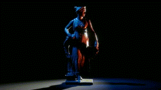
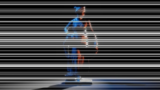
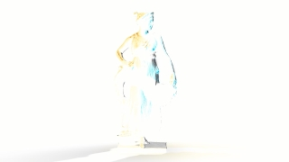
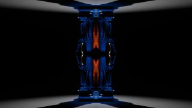

Cinema
====

**Cinema** is a collection of custom post-processing effects for Unity's [High Definition Render Pipeline](https://docs.unity3d.com/Packages/com.unity.render-pipelines.high-definition@11.0/manual/index.html) (HDRP) such as Keijiro's Kino.

[HDRP]:
    https://docs.unity3d.com/Packages/com.unity.render-pipelines.high-definition@latest

System Requirements
-------------------

- Unity 2021.1
- HDRP 11.0

Effects
-------

### Mosaic

**Mosaic** is .. 

### Radiation Blur

### Rect Block Glitch

### Distortion

### RGB Shift

### Random invert

### Negative

### Reflection

