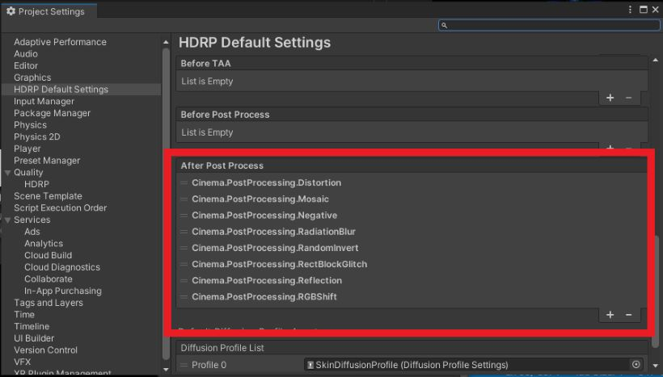

Cinema
====

**Cinema** is a collection of custom post-processing effects for Unity's [High Definition Render Pipeline](https://docs.unity3d.com/Packages/com.unity.render-pipelines.high-definition@11.0/manual/index.html) (HDRP) such as Keijiro's Kino.

Cinema is **HDRP version of kaiware007's shader** which is on the repo, [UnityVJShaderSlide20181108](https://github.com/kaiware007/UnityVJShaderSlide20181108).


./images/cinema_post_processing.mov


[HDRP]:
    https://docs.unity3d.com/Packages/com.unity.render-pipelines.high-definition@latest

System Requirements
-------------------

- Unity 2021.1
- HDRP 11.0

Effects
-------

### Mosaic


**Mosaic** is .. 

### Radiation Blur


### Distortion


### RGB Shift


### Random invert


### Negative

### Rect Block Glitch

### Reflection


## How to install


Write a package path on manifest.json

```
"jp.supertask.cinema.post-processing": "https://github.com/supertask/Cinema.git?path=/Packages/jp.supertask.cinema.post-processing",
```


## How to setup

Define custom post processing orders to make them take effect in the pipeline.




## Key binders

- F1 key: Mosaic
- F2 key: Radiation Blur
- F3 key: Rect Block Glitch
- F4 key: Distortion
- F5 key: RGB Shift
- F6 key: Random Invert
- F7 key: Negative
- F8 key: Reflection (bottom to top)
- F9 key: Reflection (right to left)

## Acknowledge

- kaiware007, UnityVJShaderSlide20181108, https://github.com/kaiware007/UnityVJShaderSlide20181108
	- He is one of the super coders I know.
- Ian McEwan, Ashima Arts (Simplex noise)
- Stefan Gustavson (Classic noise and others)
